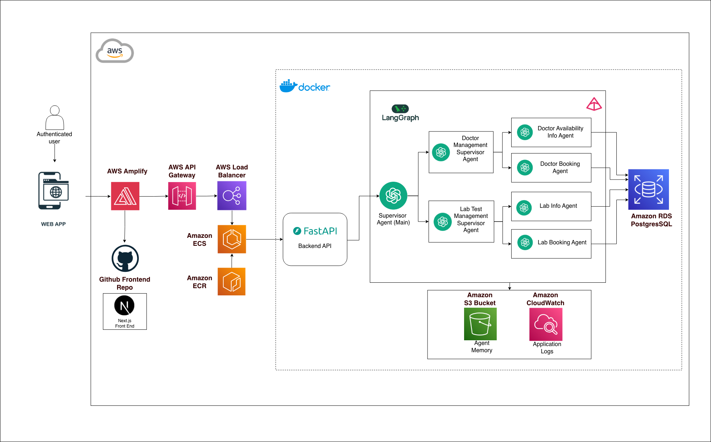

# AgenticAI Medical Appointment System

A sophisticated multi-agent AI system for managing medical appointments and lab tests and diagnostics. Built with LangGraph, FastAPI, and Next.js, this system uses an agentic architecture to intelligently route and handle patient requests through specialized agents.

## Architecture

This system implements a **hierarchical supervisor-agent pattern** using LangGraph, where a main supervisor agent routes queries to specialized supervisor agents, which in turn manage individual worker agents:

- **Supervisor Agent (Main)**: Primary orchestrator that routes requests to specialized supervisor agents
  - **Doctor Management Supervisor Agent**: Manages doctor-related operations
    - **Doctor Availability Info Agent**: Provides doctor availability information
    - **Doctor Booking Agent**: Handles appointment bookings
  - **Lab Test Management Supervisor Agent**: Manages lab test-related operations
    - **Lab Info Agent**: Provides lab test information
    - **Lab Booking Agent**: Handles lab test bookings

### System Architecture Diagram

The following diagram illustrates the complete cloud-native architecture of the system:



**Architecture Overview:**

The system is deployed on AWS with the following components:

**Frontend Layer:**
- **Next.js Frontend**: React-based web application with Server-Side Rendering (SSR) support
- **AWS Amplify**: Hosts and deploys the frontend application with CI/CD integration
- **GitHub Frontend Repo**: Source code repository that Amplify monitors for automatic deployments
- **Authenticated Users**: Access the web application through AWS Amplify

**Backend Layer:**
- **AWS API Gateway**: Entry point for API requests from the frontend
- **AWS Load Balancer**: Distributes traffic across multiple backend instances
- **Amazon ECS (Fargate)**: Container orchestration service running Docker containers
- **Amazon ECR**: Container registry storing Docker images for ECS deployment
- **FastAPI Backend API**: Python-based REST API handling business logic and agent orchestration

**AI Agent System (LangGraph & Docker):**
- **Supervisor Agent (Main)**: Primary orchestrator that routes requests to specialized supervisor agents
  - **Doctor Management Supervisor Agent**: Manages doctor-related operations and routes to:
    - **Doctor Availability Info Agent**: Provides doctor availability information and schedules
    - **Doctor Booking Agent**: Handles appointment bookings, cancellations, and rescheduling
  - **Lab Test Management Supervisor Agent**: Manages lab test-related operations and routes to:
    - **Lab Info Agent**: Provides lab test information and prerequisites
    - **Lab Booking Agent**: Handles lab test bookings and scheduling
- All agents are containerized using Docker and orchestrated through LangGraph

**Data Layer:**
- **Amazon RDS PostgreSQL**: Relational database for persistent data storage
- **Amazon S3 (Agent Memory)**: Stores conversation memory and agent state

**Monitoring & Logging:**
- **Amazon CloudWatch**: Centralized logging and monitoring for all components

**Data Flow:**
1. Authenticated users interact with the web application hosted on AWS Amplify
2. AWS Amplify pulls the Next.js frontend from the GitHub Frontend Repository
3. API requests from the frontend are routed through AWS API Gateway
4. API Gateway forwards requests to AWS Load Balancer
5. Load Balancer distributes traffic to Amazon ECS (Fargate) containers
6. FastAPI backend processes requests through the LangGraph agent system
7. The Supervisor Agent (Main) routes to appropriate specialized supervisor agents
8. Specialized supervisor agents delegate to individual worker agents
9. Individual agents interact with Amazon RDS PostgreSQL for data operations
10. Conversation memory is stored/retrieved from Amazon S3 (Agent Memory bucket)
11. All components log to Amazon CloudWatch for monitoring and observability

## Features

- **Multi-Agent System**: Intelligent routing and orchestration of patient requests
- **Conversation Memory**: Persistent memory system stored in S3 that maintains context across conversations
- **Doctor Scheduling**: Real-time availability checking and appointment booking
- **Lab Test Management**: Request and schedule lab tests and diagnostics
- **Cloud-Native Architecture**: Fully deployed on AWS with scalable infrastructure
- **Containerized Backend**: Docker-based deployment on ECS Fargate with ECR image registry
- **CI/CD Frontend**: Automated deployment via AWS Amplify with GitHub integration
- **Server-Side Rendering**: Next.js SSR support for dynamic content delivery
- **Modern UI**: Clean, responsive Next.js frontend with real-time chat interface

## Project Structure

```
AgenticAI-Medical-Appointment-System/
├── backend/                 # FastAPI backend with agent system
│   ├── agents/             # Agent implementations
│   │   ├── supervisor_agent.py
│   │   ├── doctor_appointment_agent.py
│   │   └── lab_agent.py
│   ├── data/               # Data files (profiles, availability, etc.)
│   ├── data_models/        # Pydantic models
│   ├── db/                 # Database connection and schema
│   ├── prompt_library/     # Agent prompts
│   ├── toolkit/            # Agent tools and toolkits
│   ├── utils/              # Utilities (LLM, memory, data access)
│   │   ├── s3_data_access.py  # S3-based memory storage
│   │   ├── memory.py          # Memory management
│   │   └── llms.py            # LLM configuration
│   ├── scripts/             # Data seeding and utility scripts
│   ├── Dockerfile           # Docker configuration for ECS deployment
│   ├── main.py             # FastAPI application entry point
│   └── requirements.txt    # Python dependencies
│
└── frontend/               # Next.js frontend
    ├── app/                # Next.js app directory
    ├── components/         # React components
    │   ├── ChatInterface.tsx
    │   ├── ChatWidget.tsx
    │   ├── BookingConfirmationTile.tsx
    │   └── PaymentGatewayTile.tsx
    ├── deploy.sh           # S3 deployment script
    ├── DEPLOYMENT.md       # Deployment guide
    ├── next.config.js      # Next.js configuration (static export)
    └── package.json        # Node.js dependencies
```

## Prerequisites

- **Python 3.12+**
- **Node.js 18+**
- **PostgreSQL** (Amazon RDS or local for development)
- **OpenAI API Key** (or compatible LLM provider)
- **AWS Account** (for production deployment)
- **Docker** (for containerized backend deployment)
- **AWS CLI** (for deployment)

## Installation

### Backend Setup

1. Navigate to the backend directory:
```bash
cd backend
```

2. Create a virtual environment (recommended):
```bash
python -m venv venv
source venv/bin/activate  # On Windows: venv\Scripts\activate
```

3. Install dependencies:
```bash
pip install -r requirements.txt
```

4. Set up environment variables:
Create a `.env` file in the `backend/` directory:
```env
# Database Configuration
POSTGRE_HOST=your-database-host
POSTGRE_DB_NAME=your-database-name
POSTGRE_DB_USER=your-database-user
POSTGRE_PASSWORD=your-database-password
POSTGRE_PORT=5432

# OpenAI Configuration
OPENAI_API_KEY=your_openai_api_key_here

# S3 Configuration (for agent memory)
S3_BUCKET_NAME=****
S3_REGION=****

# AWS Credentials (or use IAM role in ECS)
AWS_ACCESS_KEY_ID=your_aws_access_key
AWS_SECRET_ACCESS_KEY=your_aws_secret_key

# CORS Configuration
FRONTEND_ORIGIN=http://localhost:3000
ALLOWED_ORIGINS=http://localhost:3000
```

5. Set up the database:
```bash
# Create database and run schema
psql -U postgres -c "CREATE DATABASE medical_appointments;"
psql -U postgres -d medical_appointments -f db/schema.sql
```

6. Seed initial data (optional):
```bash
python scripts/seed_dummy_data.py
python scripts/seed_medical_appointments.py
```

### Frontend Setup

1. Navigate to the frontend directory:
```bash
cd frontend
```

2. Install dependencies:
```bash
npm install
```

3. Set up environment variables:
Create a `.env.production` file in the `frontend/` directory:
```env
NEXT_PUBLIC_BACKEND_URL=http://localhost:8000
```

For production deployment, set this to your backend API URL (API Gateway or Load Balancer URL).

## Running the Application

### Local Development

#### Start the Backend

From the `backend/` directory:
```bash
uvicorn main:app --reload --port 8000
```

The API will be available at `http://localhost:8000`

#### Start the Frontend

From the `frontend/` directory:
```bash
npm run dev
```

The frontend will be available at `http://localhost:3000`

### Production Deployment

#### Backend Deployment (AWS ECS Fargate)

1. Build Docker image:
```bash
cd backend
docker build -t agenticai-backend .
```

2. Push to ECR:

3. Deploy to ECS:
   - Create ECS cluster and service
   - Configure task definition with environment variables
   - Set up Load Balancer and API Gateway
   - Configure security groups and IAM roles

#### Frontend Deployment (AWS Amplify)

1. Push code to GitHub repository:
```bash
git add .
git commit -m "Deploy frontend"
git push origin main
```

2. Connect to AWS Amplify:
   - Go to AWS Amplify Console
   - Click "New app" → "Host web app"
   - Connect your GitHub repository
   - Select the repository and branch
   - Amplify will auto-detect Next.js and configure build settings

3. Configure build settings:
   - Amplify will use the `amplify.yml` file in the repository root
   - Set environment variables in Amplify Console:
     - `NEXT_PUBLIC_BACKEND_URL`: Your backend API Gateway URL
   - Amplify will automatically:
     - Build the Next.js application
     - Deploy with SSR support
     - Set up CloudFront distribution
     - Configure SSL certificates

4. Custom domain (optional):
   - Configure custom domain in Amplify Console
   - Amplify handles SSL certificate provisioning automatically

## API Endpoints

### POST `/execute`

Execute a query through the agent system.

**Request Body:**
```json
{
  "id_number": 12345678,
  "messages": "I need to book an appointment with a cardiologist"
}
```

**Response:**
```json
{
  "messages": [
    {
      "type": "ai",
      "content": "I'll help you book an appointment..."
    }
  ]
}
```

### GET `/health`

Health check endpoint for monitoring.

**Response:**
```json
{
  "status": "healthy",
  "timestamp": "2024-01-01T00:00:00Z"
}
```

## Configuration

### Backend Configuration

- **LLM Model**: Configured in `backend/utils/llms.py` (default: GPT-4o)
- **Database**: Connection settings in `backend/db/db_connection.py`
- **Memory Storage**: Conversation memory stored in S3 via `backend/utils/s3_data_access.py`
- **CORS**: Configured in `backend/main.py` via `FRONTEND_ORIGIN` environment variable

### Frontend Configuration

- **Next.js SSR**: Configured in `frontend/next.config.js` (SSR enabled for Amplify)
- **Backend URL**: Set via `NEXT_PUBLIC_BACKEND_URL` environment variable in Amplify Console
- **Amplify Build**: Configured via `amplify.yml` in repository root
- **Images**: Can be optimized or unoptimized depending on deployment needs

### AWS Infrastructure

- **AWS Amplify**: Frontend hosting with CI/CD, SSR support, and automatic deployments
- **GitHub Integration**: Source code repository connected to Amplify for automatic builds
- **RDS PostgreSQL**: Database for persistent data storage
- **S3 Buckets**: 
  - Agent conversation memory storage
  - (Frontend assets are managed by Amplify automatically)
- **ECS Fargate**: Containerized backend deployment
- **ECR**: Container registry for Docker images
- **API Gateway**: API endpoint management and routing
- **Load Balancer**: Traffic distribution across ECS tasks
- **CloudFront**: CDN automatically configured by Amplify for frontend delivery
- **CloudWatch**: Logging and monitoring for all components

## Development

### Running Scripts

- **Visualize Agent Graph**: `python scripts/visualize_agent_graph.py`
- **Seed Data**: `python scripts/seed_dummy_data.py`
- **Seed Appointments**: `python scripts/seed_medical_appointments.py`
- **Test Database Connection**: `python db/test_db_connection.py`
- **Test S3 Operations**: `python test_s3_operations.py`

### Testing

The system includes:
- Jupyter notebooks for experimentation (`backend/notebooks/`)
- Agent graph visualization (`backend/agent_graph.mmd`)
- Database connection testing scripts
- S3 operation testing scripts

### Environment Variable Testing

- **Backend**: Run `python test_env_vars.py` to verify all environment variables
- **Frontend**: Check `.env.production` file and verify `NEXT_PUBLIC_BACKEND_URL` is set before building

## Key Technologies

- **LangGraph**: Multi-agent orchestration and state management
- **LangChain**: LLM integration and tooling
- **FastAPI**: High-performance Python web framework
- **Next.js 14**: React framework with App Router and static export
- **PostgreSQL**: Relational database (Amazon RDS)
- **TypeScript**: Type-safe frontend development
- **Tailwind CSS**: Utility-first CSS framework
- **Docker**: Containerization for backend deployment
- **AWS Services**: Amplify, ECS, ECR, S3, CloudFront, RDS, API Gateway, Load Balancer, CloudWatch
- **boto3**: AWS SDK for Python (S3 operations)

## Contributing

1. Fork the repository
2. Create a feature branch (`git checkout -b feature/amazing-feature`)
3. Commit your changes (`git commit -m 'Add some amazing feature'`)
4. Push to the branch (`git push origin feature/amazing-feature`)
5. Open a Pull Request

## License

This project is licensed under the MIT License.

## Author

**Charuka Gunawardhane**
- Email: charukagunawardhaneixvii@gmail.com

## Acknowledgments

- Built with LangChain and LangGraph
- OpenAI for LLM capabilities
- FastAPI and Next.js communities
- AWS for cloud infrastructure

---

For more detailed information, see the README files in the `backend/` and `frontend/` directories.
